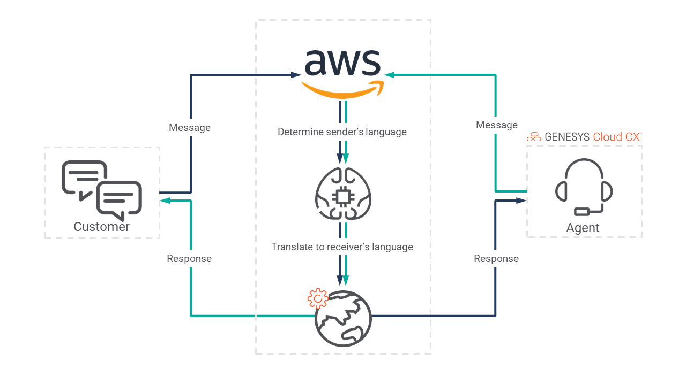
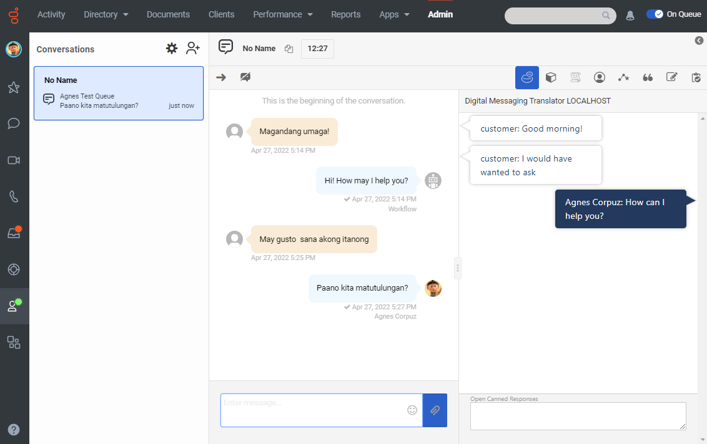
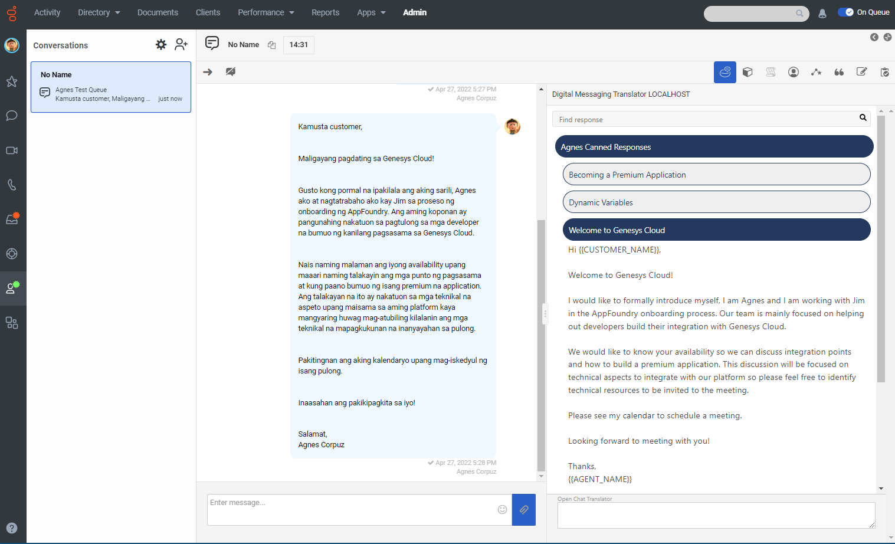
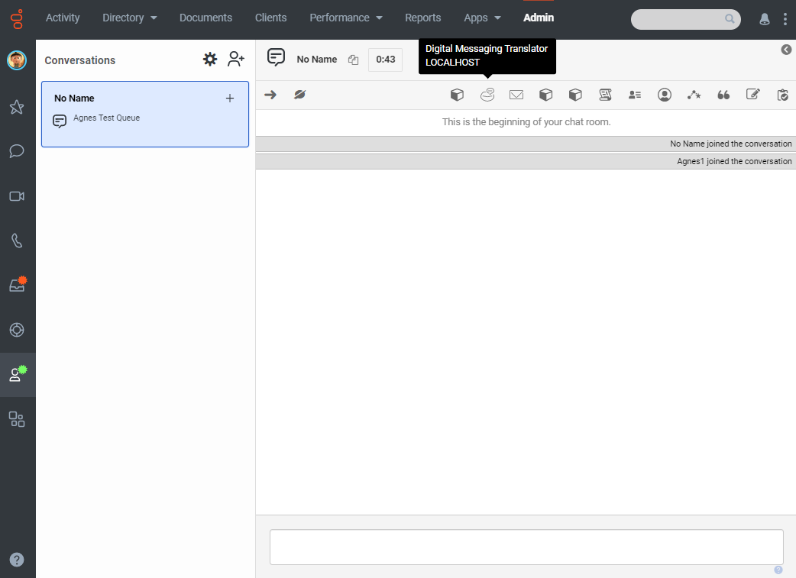

:::{"alert":"primary","title":"About Genesys Cloud Blueprints","autoCollapse":false} 
Genesys Cloud blueprints were built to help you jump-start building an application or integrating with a third-party partner. 
Blueprints are meant to outline how to build and deploy your solutions, not a production-ready turn-key solution.
 
For more details on Genesys Cloud blueprint support and practices 
please see our Genesys Cloud blueprint [FAQ](https://developer.genesys.cloud/blueprints/faq)sheet.
:::

This Genesys Cloud Developer Blueprint provides instructions for building a messaging translation assistant which uses the AWS Translate service to allow customers and agents to chat in their preferred languages. The messaging translation assistant automatically translates everything in the right side of the Interactions panel in real-time, including canned responses. This solution supports both web chat and web messaging interactions. You can deploy all the components used in this solution with the Terraform Genesys Cloud CX as Code provider.



## Scenario

An organization wants to provide a real-time translation for web chat and web messaging that allows customers and agents to have a conversation using their preferred languages:

1. **The customer sends a message in their preferred language.** The agent receives the customer's incoming message in its original language.

2. **The agent opens the messaging translation interaction widget.** The widget uses the agent's preferred language, as configured in Genesys Cloud, to display the appropriate message translation. 

3. **The agent sends a message in their preferred language.** The customer receives the agent's response translated in the customer's preferred language.

## Solution components

* **Genesys Cloud CX** - A suite of Genesys Cloud services for enterprise-grade communications, collaboration, and contact center management. In this solution, you use an Architect inbound message flow, a Genesys Cloud integration, a Genesys Cloud queue, web messaging configuration, and web messaging deployment.
* **Architect flows** - A flow in Architect, a drag and drop web-based design tool, dictates how Genesys Cloud handles inbound or outbound interactions.  In this solution, an inbound message flow provides the routing layer that gets the customer to the right queue.
* **Interaction widget integration** - The Genesys Cloud integration that enables web apps to be embedded in an iframe within Genesys Cloud. The iframe  appears only on specified interaction types and to specified agents. For this solution, Genesys Cloud uses the Interaction Widget integration to show translated web chat and web messages to the customer.
* **Web messaging and Messenger** - The Genesys Cloud messaging platform that enables asynchronous conversations and a unified agent and supervisor experience across all Genesys Cloud messaging channels. Messenger is the predefined message window that customers use to communicate with bots and agents. 
* **CX as Code** - A Genesys Cloud Terraform provider that provides an interface for declaring core Genesys Cloud objects.
* **AWS IAM** - Identity and Access Management that controls access to AWS resources such as services or features. In this solution, you set the permissions to allow the messaging translation assistant to access Amazon Translate and the AWS for JavaScript SDK.
* **Amazon Translate** - A translation service that enables cross-lingual communication between users of an application. Amazon Translate is the translation service used in this solution.

### Software development kits (SDKs)

* **Genesys Cloud Platform API SDK** - Client libraries used to simplify application integration with Genesys Cloud by handling low-level HTTP requests. In this solution, this SDK is used for the initial chat and messaging interaction between agent and customer.
* **AWS for JavaScript SDK** - This SDK enables developers to build and deploy applications that use AWS services. This solution uses the JavaScript API to enable messaging translation in an agent's browser and it uses the inside Node.js applications to enable the messaging translation interaction widget on the server where Genesys Cloud runs.

## Prerequisites

### Specialized knowledge

* Administrator-level knowledge of Genesys Cloud
* AWS Cloud Practitioner-level knowledge of AWS IAM, AWS Translate, and the AWS for JavaScript SDK
* Experience using the Genesys Cloud Platform API
* Experience with Terraform

### Genesys Cloud account

* A Genesys Cloud license. For more information, see [Genesys Cloud Pricing](https://www.genesys.com/pricing "Opens the Genesys Cloud pricing page") in the Genesys website.
* The Master Admin role. For more information, see [Roles and permissions overview](https://help.mypurecloud.com/?p=24360 "Opens the Roles and permissions overview article") in the Genesys Cloud Resource Center.
* CX as Code. For more information, see [CX as Code](https://developer.genesys.cloud/devapps/cx-as-code/ "Goes to the CX as Code page") in the Genesys Cloud Developer Center.

### AWS account

* An administrator account with permissions to access the following services:
  * AWS Identity and Access Management (IAM)
  * AWS Translate 

### Development tools running in your local environment

* Terraform (the latest binary). For more information, see [Download Terraform](https://www.terraform.io/downloads.html "Goes to the Download Terraform page") on the Terraform website.

## Implementation steps

### Download the repository containing the project files

1. Clone the [digital-messaging-translator-blueprint repository](https://github.com/GenesysCloudBlueprints/digital-messaging-translator-blueprint "Opens the digital-messaging-translator-blueprint repository in GitHub").

### Set up AWS Translate

1. Create an IAM user for the application. For more information, see [IAM users](https://docs.aws.amazon.com/IAM/latest/UserGuide/id_users.html "Opens IAM users") in the AWS documentation.
2. Add a policy to the IAM that grants full access to the AWS Translate service. For more information, see [Managing IAM policies](https://docs.aws.amazon.com/IAM/latest/UserGuide/access_policies_manage.html "Opens Managing IAM policies") in the AWS documentation.
3. Create an access key for the IAM user. For more information, see [Managing access keys for IAM users](https://docs.aws.amazon.com/IAM/latest/UserGuide/id_credentials_access-keys.html "Opens Managing access keys for IAM users") in the AWS documentation.
4. Write down the access key and secret.
5. Create an .ENV file in the directory folder and provide values for the following variables: `AWS_REGION`, `AWS_ACCESS_KEY_ID`, and `AWS_SECRET_ACCESS_KEY`.

  :::primary
  **Tip**: Start with the sample.env file in this blueprint solution, rename it to `.env` and provide your org-specific details.
  :::

### Set up Genesys Cloud

1. To run this project using the Terraform provider, open a Terminal window and set the following environment variables:

 * `GENESYSCLOUD_OAUTHCLIENT_ID` - This variable is the Genesys Cloud client credential grant Id that CX as Code executes against. 
 * `GENESYSCLOUD_OAUTHCLIENT_SECRET` - This variable is the Genesys Cloud client credential secret that CX as Code executes against. 
 * `GENESYSCLOUD_REGION` - This variable is the Genesys Cloud region in your organization.

2. Run Terraform in the folder where you set the environment variables. 

### Configure your Terraform build

In the blueprint/terraform/dev.auto.tfvars file, set the following values, which are specific to your Genesys Cloud organization:

* `environment` - The value of this free-form field combines with the prefix value to define the names of various Genesys Cloud artifacts. For example, if you set the environment name to be `dev` and the prefix to be `web-messaging` your Genesys Cloud group, queue, Messenger configuration, and Messenger deployment will all begin with `dev-web-messaging`.
* `prefix`- The value of this free-form field combines with the environment value to define the names of various Genesys Cloud artifacts.
* `email` - This value is the email account that you use with Genesys Cloud. It will be used to assign you to the appropriate Genesys Cloud group and queue.

The following is an example of the dev.auto.tfvars file.

```
environment            = "dev"
prefix                 = "web-messaging"
email                  = "test-email@company.com"
```

### Run Terraform

You are now ready to run this blueprint solution for your organization. 

1. Change to the docs/terraform folder and issue these commands:

* `terraform plan` - This command executes a trial run against your Genesys Cloud organization and shows you a list of all the Genesys Cloud resources it creates. Review this list and make sure that you are comfortable with the plan before continuing to the second step.

* `terraform apply --auto-approve` - This command creates and deploys the necessary objects in your Genesys Cloud account. The --auto-approve flag completes the required approval step before the command creates the objects.

After the `terraform apply --auto-approve` command completes, you should see the output of the entire run along with the number of objects successfully created by Terraform. Keep these points in mind:

*  This project assumes you are running using a local Terraform backing state, which means that the `tfstate` files are created in the same folder where you run the project. Terraform does not recommend using local Terraform backing state files unless you run from a desktop and are comfortable with the deleted files.

* As long as you keep your local Terraform backing state projects, you can tear down this blueprint solution by changing to the `docs/terraform` folder and issuing a `terraform destroy --auto-approve` command. This command destroys all objects currently managed by the local Terraform backing state.

### Web messaging only: deploy the snippet to your website

After you have created the Genesys Cloud objects, use a Messenger deployment to add a Messenger chat window to your website.

1. Navigate to **Admin** > **Message** > **Messenger Deployments** > **dev-web-messaging-deployment**.
2. Under **Deploy your snippet**, click **Copy to Clipboard** to copy the snippet. Paste the snippet in the `<head>` tag of the web pages where you want the Messenger to appear.

You also need to update the config file found in /docs/scripts/config.js to use the OAuth client.

1. Navigate to **Admin** > **Integrations** > **OAuth** > **Web Messages Implicit Client**.
2. Add the client ID from your OAuth client and specify the region for your Genesys Cloud organization, for example, `mypurecloud.ie` or `mypurecloud.com.au`.

### Host and run the Node.js app server

1. Verify that you are running Node.js v14.15.4 or later. 
  * To verify your version, run `node-v`.
  * To upgrade, run `nvm install 14.15.4`.
  * To install the latest version, run `npm install -g n latest`.

2. Switch to the folder where the files for your messaging translation assistant are located. In the local node-modules folder run `npm install` to install the dependencies.
3. To run the server locally, run `node run-local.js`.

### Test the solution

#### Translate web messaging interactions

1. Go to your website and start a web message.
   
2. To answer the message as an agent, in your Genesys Cloud organization change your status to **On Queue** and answer the incoming interaction.
3. To open the messaging translation assistant, click the **Messaging Translator** button, in the agent's toolbar.
   
4. Practice sending and receiving messages in different languages. When you type a message, the messaging translation assistant automatically translates it into the language that the customer is using.
  :::primary
  **Important**: To ensure that the messaging translation assistant works correctly, type in the right side of the Interaction panel. 
  :::
  
  
5. To send a translated canned response, click **Open Canned Responses** and select a canned response.  
  

#### Translate web chat interactions

1. Create a Genesys web chat widget. For more information, see [Create a widget for web chat](https://help.mypurecloud.com/?p=195772 "Opens the Create a widget for web chat article") in the Genesys Cloud Resource Center.

  :::primary
  **Important**: If you use the Genesys Cloud developer tools to test this solution, make sure that under **Widget Type** you select **Version 2**, **Version 1.1**, or **Third Party**. For more information, see [About widgets for web chat](https://help.mypurecloud.com/articles/?p=194115 "Opens the About widgets for web chat article") in the Genesys Cloud Resource Center.
  :::

2. Open the [Web Chat developer tool](https://developer.mypurecloud.com/developer-tools/#/webchat "Opens the Web Chat developer tool").

  :::primary
  **Important**: Make sure that the Developer Center URL matches the region where your Genesys Cloud organization is located. For more information, see the [Access the developer tools](https://developer.genesys.cloud/platform/quickstarts-guide/developer-tools/#accessTools "Goes to the Access the developer tools section on the Developer tools quick start page") section on the Developer tools quick start page.
  :::

3. Go to the [Chat Configuration page in the Genesys Cloud Developer Center](https://developer.genesys.cloud/developer-tools/#/webchat "Opens the Chat Configuration page in the Genesys Cloud Developer Center").
4. Click **Populate Fields**.
5. To start a chat as a customer, click **Start Chat**.
6. To answer the chat as an agent, in your Genesys Cloud organization change your status to **On Queue** and then answer the incoming interaction.
  
7. To open the messaging translation assistant, click the **Messaging Translator** button, which appears in the agent's toolbar.
8. Practice sending and receiving chats in different languages. When you type a chat, the messaging translation assistant automatically translates it into the language that the customer is using.
  :::primary
  **Important**: Make sure to type on the right pane of the interaction for the messaging translation assistant to successfully translate the agent's message.
  :::
  
9. To send a translated canned response, click **Open Canned Responses** and select a canned response.  
  

## Additional resources

* [SDK Documentation Explorer](https://developer.genesys.cloud/devapps/sdk/docexplorer "Opens the Genesys Cloud Platform Client SDK page")
* [About web messaging](https://help.mypurecloud.com/articles/about-web-messaging/ "Opens the About Web Messaging page")
* [Amazon Translate](https://aws.amazon.com/translate/ "Opens Amazon Translate page in the AWS documentation") 
* [digital-messaging-translator-blueprint repository](https://github.com/GenesysCloudBlueprints/digital-messaging-translator-blueprint "Opens the chat-translator-blueprint repository in GitHub") 
